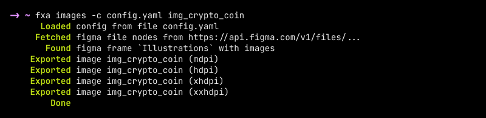

# fxa ✨ figma export for android (as it should be)

<br/>

 


A multi-platform tool for exporting resources from Figma to an Android project.

## Features

- 🥑 **fxn** convert images to WEBP and icons to Android Vector Drawable XML.

- 🥰 **fxn** works on macOS, Windows and Linux. One small executable for each platform.

- 🚀 No external dependencies. **No webp** package, **no java** and **no vd-tool** required.

- 🤖 [Figma-export](https://github.com/RedMadRobot/figma-export)-like api. Similar YAML config file, similar CLI arguments.

- 🧭 Good error description. There will always be a clear explanation after the inscription Error.

<br/>

## How to install?

> Installation via package managers will be available later.

### Installation on MacOS and Ubuntu

Just run on terminal:

* `curl -o- https://raw.githubusercontent.com/tonykolomeytsev/fxa/master/install/macos.sh | bash` — for MacOS

* `curl -o- https://raw.githubusercontent.com/tonykolomeytsev/fxa/master/install/linux.sh | bash` — for Ubuntu

* Or download and install suitable executable from [latest release](https://github.com/tonykolomeytsev/fxa/releases/latest).

### Installation on Windows

So far, there is no simple installation guide. Download the [zip archive from here](https://github.com/tonykolomeytsev/fxa/releases/latest/download/fxa-v0.1.0-x86_64-pc-windows-msvc.zip) and unzip it. Inside there will be a `fxa.exe` program, you can run it from the terminal.

### Build source code

Install Rust compiler: https://www.rust-lang.org/tools/install

And then clone and build the project with `cargo`:

```bash
cargo build --release
```

And then take the compiled program `{project_root}/target/release/fxn`

## How to use?

Use `fxn --help` for help :)

Settings for the utility are passed not only through command line arguments, but also using a YAML file. If you don't have this YAML file yet, you can generate it yourself and fill in the required fields in it. To generate the file, run:

```bash
fxn config config.yaml
```

And then fill `config.yaml` with your data. **Required fields:**

* `figma.fileId` — Identifier of the Figma file. To obtain a file id, open the file in the browser. The file id will be present in the URL after the word file and before the file name.

* `android.mainRes` — Relative or absolute path to the `main/res` folder of your android module. This field is required, but if you **store icons and images in different Gradle modules**, do not specify this parameter, specify the following:
    * `android.images.mainRes` — Path to the `main/res` folder of your Gradle module with images.

    * `android.icons.mainRes` — Path to the `main/res` folder of your Gradle module with icons.

You also need to provide Figma with a personal access token in order for the app to export resources from Figma.

How to get personal access token: https://www.figma.com/developers/api#access-tokens

Personal access token is passed as a command line argument when running the `images` and `icons` commands:

Like this: `fxa images -t TOKEN -c config.yaml <image names...>`

And this: `fxa icons -t TOKEN -c config.yaml <icon names...>`

**BUT!** You can DO NOT write the token in command line arguments if you specify the token in the `FIGMA_PERSONAL_TOKEN` environment variable.

### Setup completed, what's next?

#### Export images

Pictures will be loaded into their `drawable-XXXX` directories. Moreover, to each directory in its own scale, which is specified in the YAML config, in `android.images.scales` field:

```yaml
# default values, but you can change them
scales:
    mdpi: 1.0    # for drawable-mdpi
    hdpi: 1.5    # for drawable-hdpi
    xhdpi: 2     # and so on
    xxhdpi: 3    # etc.
```

You can specify the format for the exported image with field `android.images.format`. The format can be `png`, `webp`, `svg`. Default if `webp`. Webp compression level can be specified in parameter `android.images.webpOptions.quality`. Default quality is `85` (%).

**To export run:**

```bash
fxn images -c config.yaml img_lol "img_kek" ...
```

#### Export icons (Vector Drawable XML, SVG)

Icons will be loaded into `drawable` directory. You can specify the format for the exported icon with field `android.icons.format`. The format can be `svg` or `xml` (Android Vector Drawable). Default if `xml`.

**To export run:**

```bash
fxn icons -c config.yaml ic_24/icon1 ic_16/icon2 ...
```

### What else should I know?

The utility loads temporary files into the `.fxa/` directory. For example, it caches json with the structure of Figma documents that were previously exported. The cache files have the following names: `cache_<FIGMA_FILE_ID>.json`.

This is done because accessing the file through the Figma API can take a very long time, and if you suddenly misspelled the name of the image/icon, you might not have to reload the whole Figma document.

But if something has been updated in the original Figma document, then you won't see those changes because of the cache. Therefore, here is the command that clears the cache:

```bash
fxn cleanup
```

## Project status

The project is in progress and is being developed just for fun. Additional features will be added in the future.